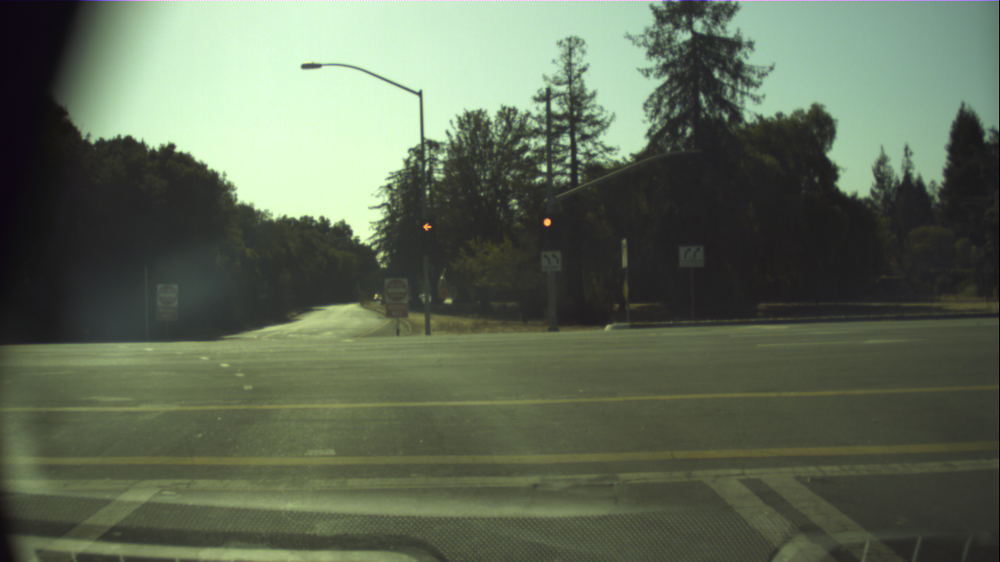

Project: Programming a Real Self-Driving Car
===

# Team NeedForSpeed
* Team Lead
    * Feng Xiao (xiaofeng.ustc@gmail.com)
* Members
    * David G (djg9610@gmail.com)
    * David Simon (simonarama@yahoo.com)
    * Guillermo Gómez (ggomezbella@gmail.com)
    * Liheng Chen (liheng@freenet.de)

# Project Result Videos

The result of this project can be found from the following videos:

* Running everything on simulator: [https://youtu.be/YFt2R3aFveA](https://youtu.be/YFt2R3aFveA)

* Trafflic light detection and classification on simulator: [https://youtu.be/4QHtUHBuSWI](https://youtu.be/4QHtUHBuSWI)

* Traffic light detection and classification on ros bag file of testing lot: [https://youtu.be/2jP-MySAgEo](https://youtu.be/2jP-MySAgEo)

# Project Architecture

As introduced in the project walkthrough, The vehilce subsystem contains mainly three different parts, perception, planning and control. And each part contains several different ros nodes for different functions. Different ros nodes communicate with each other by subscribing or publishing to interesting ros topics. The project software architecture can be shown as following:

# Traffic Light Detection
An import part of perception in this project is to detect traffic light state from image. Though in simulator the ground truth traffic light state is provided, in real car, we need to get the traffic light state based on image only. And before that, we need to detect the traffic light state from image in simulator too.

In this project, we make use of transfer learning and [Tensorflow Object Detection API](https://github.com/tensorflow/models/tree/master/research/object_detection). The main steps can be described as following:

1. Train a model for general traffic light detection and classification

    * Select a pretrained general object detection model from [Tensorflow Object Detection Model Zoo](https://github.com/tensorflow/models/blob/master/research/object_detection/g3doc/detection_model_zoo.md).

    * Collect general traffic light detection and classification dataset.

    * Perform transfer learning on the pretrained general object detection model using the traffic light dataset, and get a general traffic light detection and classification model.

2. Train a model based on general traffic light detection and classification for simulator images

    * Collect traffic light detection and classification dataset from simulator.

    * Perform transfer learning on the general traffic light detection and classification model using the simulator traffic light dataset.

    * Use this model in simulator for traffic light detection and classification.

3. Train a model based on general traffic light detection and classification for real world testing environment images

    * Collect traffic light detection and classification dataset from ros bag file provided for real world testing environment.

    * Perform transfer learning on the general traffic light detection and classification model using the real world testing environment traffic light dataset.

    * Use this model in testing car for traffic light detection and classification.

## Selection of pretrained object detection model

Tensorflow provides a lot of pre-trained object detection models in the [Tensorflow Object Detection Model Zoo](https://github.com/tensorflow/models/blob/master/research/object_detection/g3doc/detection_model_zoo.md). Since this part will be running in the real car in real time, speed is quite important, and of course, accuracy is also critical. After trying out several different pretrained models, we finally select [ssd_mobilenet_v2_coco](http://download.tensorflow.org/models/object_detection/ssd_mobilenet_v2_coco_2018_03_29.tar.gz). This model is very fast to run and it is also accurate enough.

## General purpose traffic light dataset

In this project, we use the [Bosch Small Traffic Light Dataset](https://hci.iwr.uni-heidelberg.de/node/6132) to train the general purpose traffic light detection and classification model. The training set of this dataset contains 15 different labels, however, in our project, we only need 4 different lables, red, yellow, green and off. We preprocessed the test.yaml file and replaced those extra labels with corresponding red, yellow, green or off lable. And also we split the dataset into 80/20. 80% of the samples are used for training and 20% of the samples are used for validation.

## Training result of general traffic light detection and classification

By applying transfer learning on the general ssd_mobilenet_v2_coco model and train it with the Bosch small traffic light dataset, we got the following training result.

The config file for using the Tensorflow Object Detection pipeline can be found [here](./traffic_light_detection/models/model/ssd_mobilenet_v2_coco_4_classes.config). After the model is trained, it works quite well on general traffic light detection and classification, you can see the results from the following images:

## Collection of annotated data

After getting the general traffic light detection and classification, we try to use it directly in our project for both simulator and the ros bag file. However, the results are not so good. In simulator, it can detect the traffic light states, however, the result is not so stable and sometimes it fails. For the ros bag file, due to the special lighting condition and the reflection of the wind schield, it fails to detect the traffic lights most of the time.

To make the model perform better, we need to feed it with special data for the simulator and the ros bag file. Since the simulator and the ros bag file are so different, we decide to train two different models, one for each.

The straight forward way to collect training data from the simulator and the training ros bag file is to annotate images ourselves. Thanks to [coldKnight](https://drive.google.com/file/d/0B-Eiyn-CUQtxdUZWMkFfQzdObUE/view?usp=sharing), he shared this annotated simulator and ros bag file dataset. So we could save a lot of time annotating the images. After some double checking and minor fixing of the dataset, we could use them for training our specific traffic light detection and classification models.

## Training result of simulator traffic light detection and classification

By applying transfer learning on the general traffic light detection and classification model and training it with the annotated simulator traffic light examples, we get the following training result:

The config file for using the Tensorflow Object Detection pipeline can be found [here](./traffic_light_detection/models/model/ssd_mobilenet_v2_coco_3_classes_annotated_sim.config). The result of running this mode on the simulator images can be found from [https://youtu.be/4QHtUHBuSWI](https://youtu.be/4QHtUHBuSWI). And the following are some examples of applying this model on some simulator images:

## Training result of ros bag file traffic light detection and classification

By applying transfer learning on the general traffic light detection and classification model and training it with the annotated ros bag file traffic light examples, we get the following training result:

The config file for using the Tensorflow Object Detection pipeline can be found [here](./traffic_light_detection/models/model/ssd_mobilenet_v2_coco_3_classes_annotated_real.config). The result of running this model on the provided ros bag file can be found [https://youtu.be/2jP-MySAgEo](https://youtu.be/2jP-MySAgEo). And the following are some examples of applying this model on some images from the testing ros bag file:

# Vehicle Controller
